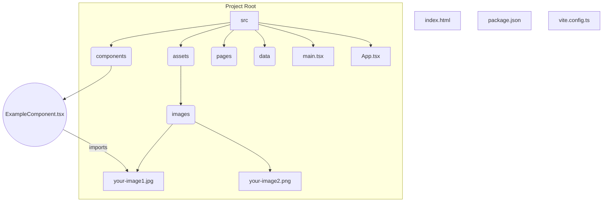

# Image Strategy for the Project

This document outlines the agreed-upon strategy for adding and managing images within this Vite/React project.

## 1. Directory Structure

All static image assets should be placed within the following directory:

```
src/assets/images/
```

If this directory structure does not exist, it should be created.



## 2. Adding Images

Place your image files (e.g., `.jpg`, `.png`, `.svg`, `.webp`) directly into the `src/assets/images/` directory.

## 3. Referencing Images in Components

To use an image within a React component (`.tsx` file), import it directly and use the imported variable as the `src` attribute for an `` tag. Vite will handle the necessary processing and path resolution during the build process.

**Example:**

```typescript
// Example in src/components/SomeComponent.tsx
import React from 'react';
import myImage from '../assets/images/my-image.png'; // Adjust path as needed

const SomeComponent: React.FC = () => {
  return (
    <div>
      <h2>Component with Image</h2>
      
    </div>
  );
};

export default SomeComponent;
```

This approach ensures that images are treated as part of the module graph, allowing Vite to optimize them and handle them correctly during development and production builds.